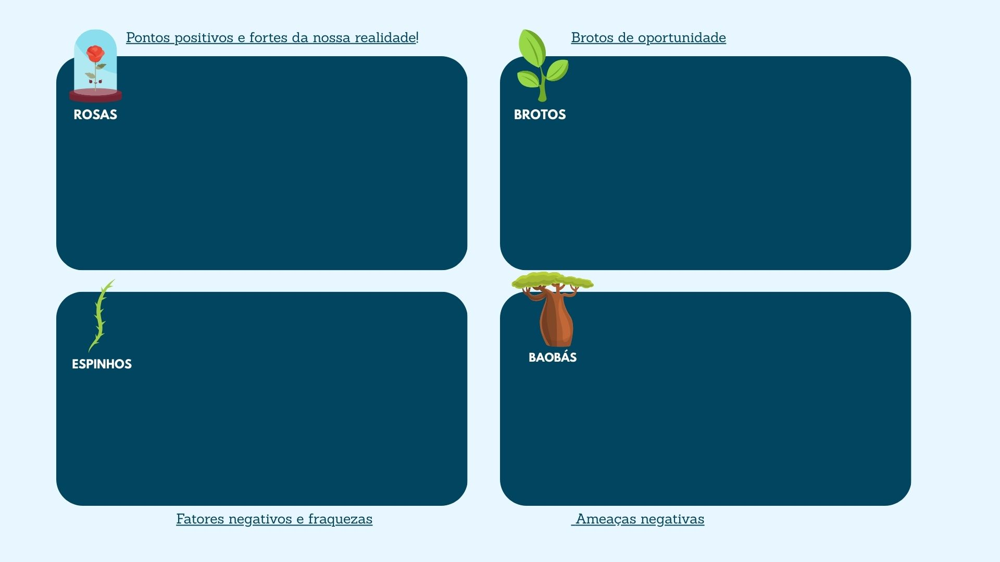
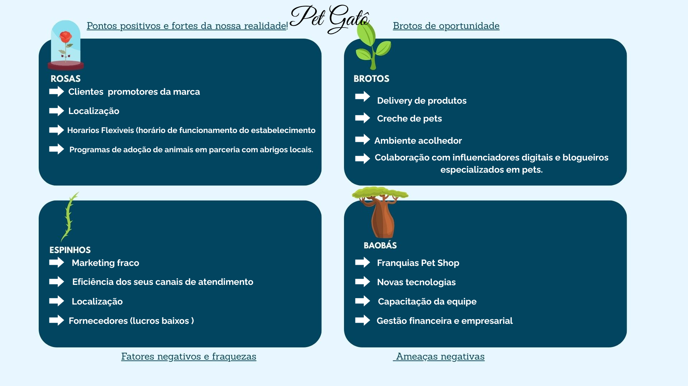
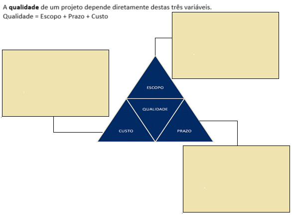
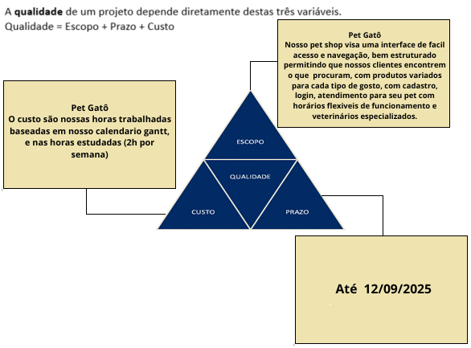

## Análise de viabilidade SWOT (FOFA)
A análise de viabilidade mensura os riscos de um projeto, uma boa ferramenta para esta análise é através da matriz SWOT

- Forças (Strengths)
- Fraquezas (Weaknesses)
- Oportunidades (Opportunities)
- Ameaças (Threats)

## Força (Strengths)
- Quais as vantagens?
- Diferenciais

## Fraquezas (Weaknesses)
- Segurança
- Sistema não estruturado/Má infraestrutura
- Obedece a lei (LGPD)?

## Oportunidades (Opportunities)
- Caso o projeto tenha continuidade ou não
- Cuidado com hype das coisas
- No futuro vai ter oportunidade do negócio crescer?
- Ver as tendencias do mercado
- Seu projeto tem uma linha de crescimento? 
- Qual a tendencia do mercado?

  - Como saber se é uma tendencia?
  🠒 Quando algo engloba tanto a classe alta como a media e baixa, por exemplo academia virou tendencia porque cada vez mais precisamos cuidar da saude.

## Ameaças (Threats)
- Concorrentes
- Por que meus concorrentes estão conseguindo pegar mecado e eu não?
- Identifique suas ameaças
- Preços melhores

  - Riscos externos
  🠒 Exemplo casas de aposta: Fica visivel que vicia, que compromete renda famíliar, pessoas de família perdem todo dinheiro apostando etc.

|Em analogia com "O Pequeno Príncipe" onde ele tinha como sua maior motivação a rosa, seus espinhos como ameaça, os brotos como oportunidades e os baobás como ameaças já que é uma árvore muito grande que podia devorar o planeta inteiro, faça a análise do seu projeto|
|:-:|
||

|Exemplo PetShop|
|:-:|
||

# Triângulo de Ferro 

- Escopo:
  - Detalha o escopo do seu projeto
  - Equilibrio 
  - Ter qualidade
  - Descrever todo projeto
  - Detalhar o projeto 

- Custo:
  - Quantidade de dinheiro
  - Funcionarios
  - Caso altere em um, altera nos outros e a qualidade cai

- Prazo:
  - 2 anos 
  - 5 anos
  - 1 mês

|Exemplo PetShop|
|:-:|
||

